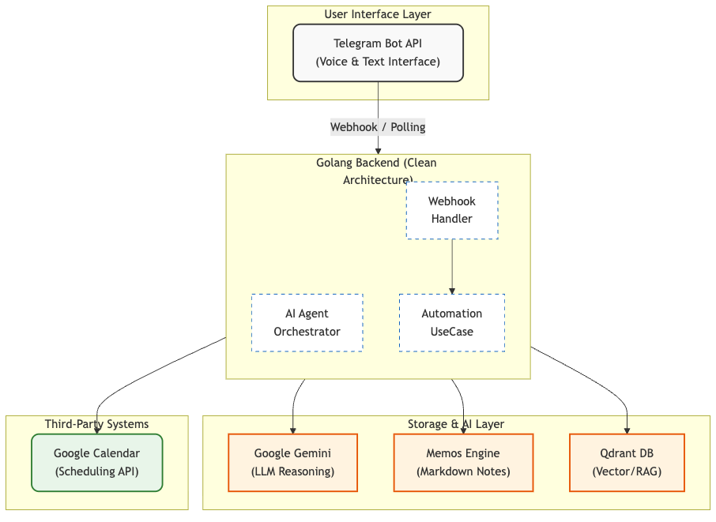

# Autonomous Task Management

*Read this*Đọc bản [Tiếng Việt](README.md).*
  

> **"A single Telegram message, AI handles the rest"**  
> An autonomous task management system integrating Agentic AI, semantic search, and workflow automation via Git webhooks.

---

## What problem does this solve?

Do you ever:

- Open 5-6 different apps (Notion, Google Calendar, Slack, GitHub...) just to note down a task?
- Miss a deadline because it got buried inside a wall of text?
- Manually update a ticket status after merging a PR?
- Spend hours searching for the context behind an old project?

**Autonomous Task Management** solves EVERYTHING via a single UI: **Telegram**.

### Practical Examples

**Scenario 1: Lightning Fast Task Creation**

```
You: "Remind me at 9 AM tomorrow to review PR #123 for the SMAP project"

Bot: Task Created!
     Memo: memos.local/m/456
     Calendar: Scheduled for 9:00 AM tomorrow
     Tags: #project/smap #pr/123
```

**Scenario 2: Intelligent Retrieval**

```
You: /ask Do I have any deadlines this week?

Bot: Let me check...
     [Agent automatically triggers search_tasks and check_calendar tools]
     
     You have 3 deadlines:
     1. Review PR #123 - Monday, 9:00 AM
     2. Deploy staging - Wednesday, 2:00 PM  
     3. Client meeting - Friday, 10:00 AM
```

**Scenario 3: 100% Automation**

```
[You merge PR #123 on GitHub]

Bot: Automatically marked as completed:
     - [x] Review code
     - [x] Fix bugs
     - [x] Update docs
     
     Task "Review PR #123" is now Done!
```

---

## Core Features

### Autonomous AI Agent (ReAct Framework)

- **Multi-step reasoning**: The agent autonomously decides which tools to invoke (search, calendar, checklist)
- **Contextual parsing**: No rigid commands necessary. Chat as you would with a human.
- **Bulk processing**: Paste a massive plan, and the AI correctly splits it into distinct tasks.

### Semantic Search

- **Vector Database (Qdrant)**: Searches by concept and intent, ignoring strict keyword correlations.
- **Multilingual**: Supports English, Vietnamese, and many other languages.
- **Lightning speed**: Results fetched in under 500ms.

### Smart Checklist Management

- **Markdown-native**: Author checklists normally using `- [ ]` and `- [x]`
- **Partial matching**: `/check abc123 code` locates matching checkboxes utilizing fuzzy string matches.
- **Progress tracking**: View real-time telemetry with `/progress <taskID>`

### Git Workflow Automation

- **GitHub/GitLab webhooks**: Natively updates states when PRs merge or issues are closed.
- **Tag-based matching**: Utilize `#pr/123` to link tasks with a target Git object.
- **Zero manual work**: Code merge → Task completes.

### Google Calendar Integration

- **Auto-scheduling**: Automatically inserts events into Google Calendar if timeframes are deduced.
- **Conflict detection**: AI Agent reviews timezone availability prior to booking.
- **Deep links**: Direct hyperlinks from the Calendar Event back to the full context Memo.

---

## Technical Architecture



### Tech Stack

**Backend:**

- **Language**: Go 1.25.7 (Clean Architecture + DDD)
- **Framework**: Gin (HTTP), Air (Hot reload)
- **Deployment**: Docker Compose (100% containerized)

**AI & ML:**

- **LLM**: Google Gemini 2.0 Flash (Agent orchestration, NLU)
- **Embeddings**: Voyage AI voyage-3 (1024 dimensions, multilingual)
- **Vector DB**: Qdrant (Semantic search, RAG)

**Storage:**

- **Primary**: Memos (Self-hosted, Markdown-native)
- **Vector**: Qdrant (Embeddings storage)

**Integrations:**

- **Chat**: Telegram Bot API
- **Calendar**: Google Calendar API (OAuth2)
- **Git**: GitHub/GitLab Webhooks (HMAC-secured)

---

## Quick Start

### Prerequisites

- Docker & Docker Compose
- Go 1.25+ (for dev only)
- Ngrok account (to receive webhooks securely)

### 1. API Keys configuration

You will need to retrieve the following API credentials (details laid out in the [Configuration Guide](documents/configuration-guide.en.md)):

- **Telegram Bot Token** - Chat UI
- **Gemini API Key** - AI brain
- **Voyage AI API Key** - Embeddings
- **Memos Access Token** - Storage endpoint
- **Google Calendar Credentials** - Scheduling (optional)
- **Ngrok Auth Token** - Webhook tunneling
- **Webhook Secret** - Git integration security (optional)

👉 **[See detailed setup instructions here](documents/configuration-guide.en.md)**

### 2. Bootstrapping

```bash
# Copy environment template
cp .env.example .env

# Create secrets folder
mkdir -p secrets

# Start all services
make up
```

Services will be actively listening at:

- **Backend API**: <http://localhost:8080>
- **Memos**: <http://localhost:5230>
- **Qdrant**: <http://localhost:6333>
- **Ngrok Dashboard**: <http://localhost:4040>

---

## Usage Guide

### Natural Language Creation

Engage as normal, the AI determines the required structure:

```
"Deadline for the SMAP project is March 15th"
"Call client XYZ at 10 AM on Monday"
"Review PR number 456 on the backend repository"
```

### Lightning Lookup

```bash
/search meeting tomorrow
/search deadline march
/search bug login
```

### Smart Agent Orchestration

```bash
/ask What meetings do I have this week?
/ask What is the closest deadline?
/ask Summarize the work done on project XYZ
```

### Checklist Manipulation

```bash
# View tracking telemetry
/progress abc123

# Mark the whole task completed
/complete abc123

# Toggle specific checklist items via partial match
/check abc123 Write tests
/uncheck abc123 Review code
```

### Bulk Import

Provide a massive wall of text containing distinct routines:

```
Plan for the week:
- Monday: Review PR #123
- Tuesday: Client meeting at 10 AM
- Wednesday: Deploy to staging
- Thursday: Write external documentation
- Friday: Code review sessions
```

The AI dynamically generates 5 distinct task objects mapped onto their respective timestamps!

---

## Development

### Project Structure

```
.
├── cmd/api/              # Main application
├── internal/
│   ├── agent/           # AI Agent orchestrator
│   ├── automation/      # Webhook automation logic
│   ├── checklist/       # Markdown checklist parser
│   ├── task/            # Task management (usecase, repo, delivery)
│   ├── webhook/         # Git webhook handlers
│   └── httpserver/      # HTTP server & routing
├── pkg/                 # Shared packages
│   ├── gemini/         # Gemini LLM client
│   ├── voyage/         # Voyage AI embeddings
│   ├── qdrant/         # Qdrant vector DB client
│   ├── telegram/       # Telegram bot client
│   └── gcalendar/      # Google Calendar client
├── config/             # Configuration
├── documents/          # Documentation & guides
└── scripts/            # Utility scripts
```

### Makefile Directives

```bash
make up          # Start all services
make down        # Stop all services
make restart     # Restart backend only
make logs        # Tail backend logs
make test        # Spin off testing suites
make build       # Compile binary executable
```

---

## Security

### Webhook Security

- **HMAC Signature Verification**: Validates Git requests cryptographically.
- **Rate Limiting**: Throttles payloads to 60 req/minute per IP address.
- **IP Whitelist**: Rejects traffic originating outside of defined subnets.
- **Constant-time Comparison**: Neutralizes complex timing attacks vectors.

### Secret Management

- Credentials reside strictly in `.env` and `secrets/` folders (gitignored).
- Google Calendar operates on robust OAuth2 Refresh Tokens.
- Local Memos tokens possess customized access capabilities.

---

## System Performance

- **Webhook acknowledgment**: <100ms
- **Background asynchronous processing**: <2s
- **Checklist parsing execution**: <10ms
- **Semantic search latency**: <500ms
- **Memory footprint**: ~150MB (all lightweight services aggregated)

---

## Troubleshooting

### Bot Unresponsive

```bash
# Check container logs
make logs

# Verify webhook tunnel binding
curl http://localhost:4040/api/tunnels

# Determine credential validity
curl https://api.telegram.org/bot<YOUR_TOKEN>/getMe
```

### Qdrant Zero Result Matching

```bash
# Verify internal collection existence
curl http://localhost:6333/collections/tasks

# Re-embed all legacy tasks to bootstrap Qdrant payload
go run scripts/backfill-embeddings/main.go
```

### Webhook Silence

1. Verify `.env` Webhook secret correlates directly to the Git repository UI setting.
2. Confirm Ngrok tunnel integrity: <http://localhost:4040>
3. Access event trace via `make logs`.

---

## Documentation Index

- [Configuration Guide](documents/configuration-guide.en.md) - API key fetching manual.
- [Master Plan](documents/master-plan.md) - Comprehensive architectural blueprints.
- [Phase 1-4 Plans](documents/) - Sequential roadmap outlines.
- [Google Calendar Setup](documents/google-calendar-setup.md) - OAuth2 deployment framework.

---

## Roadmap

- [x] Phase 1: Infrastructure setup
- [x] Phase 2: Core task management + Telegram
- [x] Phase 3: RAG + Agent orchestrator
- [x] Phase 4: Automation + Git webhooks
- [ ] Phase 5: Mobile app (React Native)
- [ ] Phase 6: Team collaboration features
- [ ] Phase 7: Analytics & insights

---

## Contributing

Contributions are welcome! Please read our contributing guidelines first.

---

## License

MIT License - feel free to use for personal or commercial projects.

---

**Made with ❤️ by developers, for developers**
